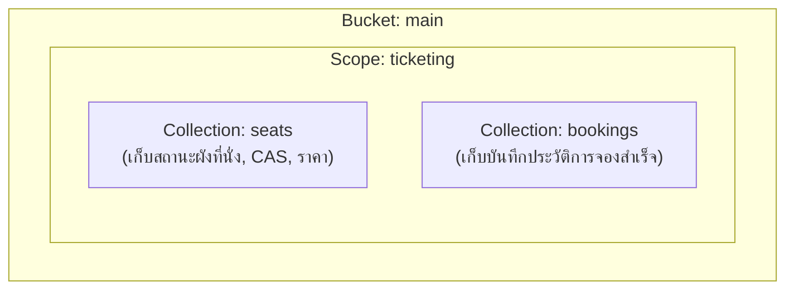
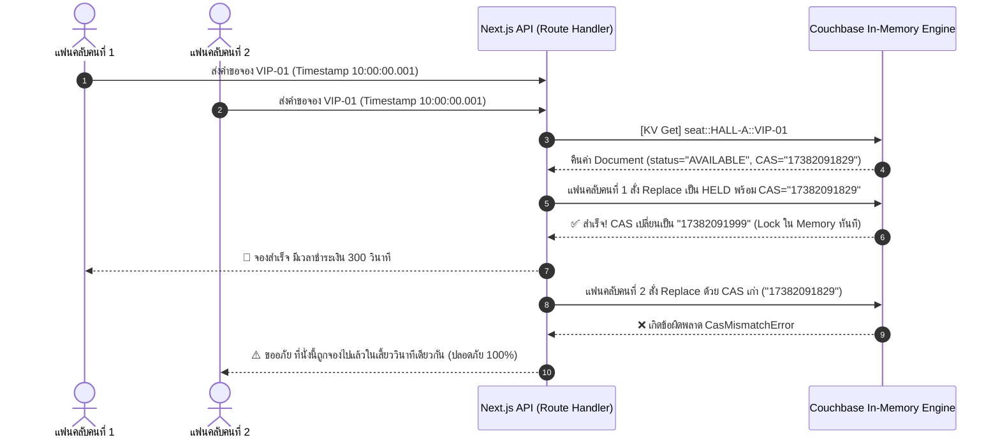

# ระบบจำลองการกดบัตรคอนเสิร์ตความเร็วสูง (High-Concurrency Concert Ticket Rush Engine)
## เอกสารการออกแบบสถาปัตยกรรมระบบอย่างละเอียด (System Architecture & Technical Specification)

> **มาตรฐานการออกแบบ:** Next.js (App Router, TypeScript, Tailwind CSS) ร่วมกับ **Couchbase NoSQL Database**  
> **แนวทางการออกแบบ UI/UX:** ยึดหลัก **Restraint & Single Accent Voltage** ตาม `design.md` และกฎบัตร `GEMINI.md`  
> **วันที่มีผลบังคับใช้:** 7 ตุลาคม 2026

---

## สารบัญ
1. [ภาพรวมของระบบและโจทย์ทางธุรกิจ (Executive Summary & Business Context)](#1-ภาพรวมของระบบและโจทย์ทางธุรกิจ)
2. [โครงสร้างฐานข้อมูล Couchbase (Database Architecture)](#2-โครงสร้างฐานข้อมูล-couchbase)
   - [2.1 สถาปัตยกรรม Scopes & Collections](#21-สถาปัตยกรรม-scopes--collections)
   - [2.2 ข้อกำหนด Document Key](#22-ข้อกำหนด-document-key)
   - [2.3 Schema Definition & Zod Validation (พร้อม Audit Fields)](#23-schema-definition--zod-validation)
   - [2.4 ดัชนีและการคิวรี (SQL++ GSI Indexes)](#24-ดัชนีและการคิวรี-sql-gsi-indexes)
   - [2.5 กลไก CAS (Compare-And-Swap) และ Concurrency Flow](#25-กลไก-cas-compare-and-swap-และ-concurrency-flow)
   - [2.6 การคืนที่นั่งอัตโนมัติด้วย Document TTL (Time-To-Live)](#26-การคืนที่นั่งอัตโนมัติด้วย-document-ttl)
3. [สถาปัตยกรรมระบบหลังบ้าน (Backend Layered Architecture)](#3-สถาปัตยกรรมระบบหลังบ้าน-backend-layered-architecture)
   - [3.1 โครงสร้างโฟลเดอร์และหน้าที่ของแต่ละชั้น (Clean Architecture)](#31-โครงสร้างโฟลเดอร์)
   - [3.2 Standard API Response Wrapper](#32-standard-api-response-wrapper)
   - [3.3 Core Service Implementation (CAS & Race Condition Engine)](#33-core-service-implementation)
4. [สถาปัตยกรรมระบบหน้าบ้าน (Frontend UI/UX Architecture)](#4-สถาปัตยกรรมระบบหน้าบ้าน-frontend-uiux-architecture)
   - [4.1 Design Tokens ตามปรัชญา `design.md`](#41-design-tokens)
   - [4.2 Typography & Thai Language Harmony](#42-typography--thai-language-harmony)
   - [4.3 โครงสร้าง Component และ Layout](#43-โครงสร้าง-component-และ-layout)
   - [4.4 มาตรฐานความพร้อมใช้งานและการป้องกันข้อผิดพลาด (UX Defensiveness)](#44-มาตรฐานความพร้อมใช้งาน)
5. [ลำดับการนำเสนอผลงาน (Storytelling & Live Demo Walkthrough)](#5-ลำดับการนำเสนอผลงาน)

---

## 1. ภาพรวมของระบบและโจทย์ทางธุรกิจ

### 1.1 ปัญหาของระบบจำหน่ายบัตรคอนเสิร์ตยอดนิยม (The Flash Crowd Problem)
เมื่อเปิดจำหน่ายบัตรคอนเสิร์ตระดับปรากฏการณ์ เช่น **Fujii Kaze: Best of Fujii Kaze Live in Bangkok** หรือคอนเสิร์ตใหญ่ของวงไอดอลมาแรงอย่าง **CORTIS: The 1st Live Showcase** ในเวลา 10:00:00 น. จะมีแฟนคลับนับหมื่นคนกดแย่งที่นั่ง **VIP แถวหน้าสุด (เช่น A-01)** ในเสี้ยววินาทีเดียวกัน:
* **ปัญหาฐานข้อมูลแบบเดิม (RDBMS / Generic NoSQL):**
  * เกิด **Race Condition** ทำให้เกิดการจองซ้ำซ้อน (Double Booking / Overselling)
  * หากใช้ Pesimistic Lock (ล็อกตาราง/ล็อกแถว) จะเกิด **Lock Contention** ทำให้เซิร์ฟเวอร์ค้าง เว็บล่ม แฟนคลับหัวเสีย
  * การตรวจสอบที่นั่งที่หมดเวลาชำระเงิน ต้องรัน Cron Job วนลูปสแกนฐานข้อมูลตลอดเวลา ทำให้สิ้นเปลืองทรัพยากร

### 1.2 เหตุผลที่ Couchbase ตอบโจทย์ระดับ World-Class
1. **Memory-First Sub-millisecond KV Access:** ข้อมูลสถานะที่นั่งอยู่ใน RAM อ่านได้เร็วกว่า 1 มิลลิวินาที รองรับการรีเฟรชผังที่นั่งพร้อมกันได้มหาศาล
2. **CAS (Compare-And-Swap):** ตรวจสอบเวอร์ชันเอกสารระดับอะตอมมิกใน RAM ไม่ต้องล็อกแถว ป้องกัน Double Booking ได้ 100%
3. **Native Document TTL:** ตั้งเวลาหมดอายุเอกสารการจองชั่วคราว (เช่น 300 วินาที) คืนที่นั่งอัตโนมัติที่ระดับ Storage Engine โดยไม่ต้องพึ่ง Cron Job
4. **SQL++ (N1QL) Analytics:** สามารถคิวรีดูสถิติรายได้และที่นั่งว่างตามโซนด้วยไวยากรณ์ SQL มาตรฐานบนเอกสาร JSON

---

## 2. โครงสร้างฐานข้อมูล Couchbase



### 2.1 สถาปัตยกรรม Scopes & Collections
* **Bucket:** `main`
* **Scope:** `ticketing`
* **Collections:**
  * `concerts`: ข้อมูลคอนเสิร์ต (ศิลปิน Fujii Kaze, CORTIS, วันที่จัด, สถานที่จัด)
  * `seats`: เอกสารผังที่นั่งทั้งหมดในแต่ละคอนเสิร์ต
  * `bookings`: เอกสารการจองที่เสร็จสมบูรณ์

### 2.2 ข้อกำหนด Document Key
ใช้รูปแบบ `<collection>::<identifier>` ที่มีความหมายและค้นหาได้ทันทีผ่าน Key-Value:
* **Concert Key:** `concert::<concertId>` เช่น:
  * `concert::fujii-kaze-bkk` (Fujii Kaze: Best of Fujii Kaze Live at Impact Arena)
  * `concert::cortis-debut-bkk` (CORTIS: The 1st World Tour Showcase at Thunder Dome)
* **Seat Key:** `seat::<concertId>::<seatId>` เช่น:
  * `seat::fujii-kaze-bkk::MATSURI-VIP-01`
  * `seat::cortis-debut-bkk::FRONT-VIP-01`
* **Booking Key:** `booking::<bookingId>` เช่น `booking::BK-20261007-99128`

---

### 2.3 Schema Definition & Zod Validation

```typescript
// src/validators/concert.schema.ts
import { z } from "zod";

export const ConcertDocumentSchema = z.object({
  _type: z.literal("concert"),
  id: z.string(),
  artist: z.string(), // "Fujii Kaze" หรือ "CORTIS"
  title: z.string(),  // เช่น "Best of Fujii Kaze Live in Bangkok"
  venue: z.string(),  // "Impact Arena, Exhibition Hall"
  date: z.string(),
  status: z.enum(["OPEN_FOR_SALE", "SOLD_OUT", "UPCOMING"]),
  zones: z.array(z.object({
    id: z.string(),
    name: z.string(), // เช่น "Matsuri VIP Box (6,500 THB)" หรือ "Kirari Catwalk (4,500 THB)"
    price: z.number().positive(),
  })),

  // Audit Fields
  createdAt: z.string().datetime(),
  updatedAt: z.string().datetime(),
  deletedAt: z.string().datetime().nullable().default(null),
  createdBy: z.string().default("system"),
  updatedBy: z.string().default("system"),
});

export type ConcertDocument = z.infer<typeof ConcertDocumentSchema>;
```

```typescript
// src/validators/seat.schema.ts
import { z } from "zod";

export const SeatStatusEnum = z.enum([
  "AVAILABLE", // ที่นั่งว่าง พร้อมให้จอง
  "HELD",      // อยู่ระหว่างรอชำระเงิน (มี TTL กำกับ)
  "BOOKED"     // ชำระเงินเรียบร้อยแล้ว
]);

export const SeatDocumentSchema = z.object({
  _type: z.literal("seat"),
  id: z.string(),
  concertId: z.string(), // เช่น "fujii-kaze-bkk" หรือ "cortis-debut-bkk"
  hallId: z.string().default("HALL-A"),
  zone: z.string(), // "MATSURI-VIP", "KIRARI-ZONE", "CORTIS-VIP", etc.
  zoneName: z.string(), // ชื่อโซนภาษาไทยที่สวยงาม เช่น "โซน Matsuri VIP แถวหน้า"
  row: z.string(),
  seatNumber: z.number().int().positive(),
  label: z.string(), // เช่น "VIP-01"
  price: z.number().positive(),
  status: SeatStatusEnum,
  
  // Concurrency & Reservation Metadata
  heldBy: z.string().nullable().default(null),
  heldUntil: z.string().datetime().nullable().default(null),
  bookingId: z.string().nullable().default(null),

  // Audit Fields ตามมาตรฐาน GEMINI.md
  createdAt: z.string().datetime(),
  updatedAt: z.string().datetime(),
  deletedAt: z.string().datetime().nullable().default(null),
  createdBy: z.string().default("system"),
  updatedBy: z.string().default("system"),
});

export type SeatDocument = z.infer<typeof SeatDocumentSchema>;
```

```typescript
// src/validators/booking.schema.ts
import { z } from "zod";

export const BookingDocumentSchema = z.object({
  _type: z.literal("booking"),
  id: z.string(),
  seatId: z.string(),
  userId: z.string(),
  userName: z.string(),
  pricePaid: z.number().positive(),
  paymentStatus: z.enum(["PAID", "FAILED", "EXPIRED"]),
  casToken: z.string(), // บันทึก CAS Token ขณะทำรายการ

  // Audit Fields
  createdAt: z.string().datetime(),
  updatedAt: z.string().datetime(),
  deletedAt: z.string().datetime().nullable().default(null),
  createdBy: z.string(),
  updatedBy: z.string(),
});

export type BookingDocument = z.infer<typeof BookingDocumentSchema>;
```

---

### 2.4 ดัชนีและการคิวรี (SQL++ GSI Indexes)

```sql
-- 1. Index ดึงผังที่นั่งตามโซนและสถานะ (ใช้สำหรับหน้าแสดงผล Seat Map)
CREATE INDEX `idx_seats_hall_zone_status` 
ON `main`.`ticketing`.`seats`(`hallId`, `zone`, `status`, `row`, `seatNumber`)
WHERE `deletedAt` IS NULL;

-- 2. Index สำหรับตรวจสอบสถิติการจองรายบุคคล
CREATE INDEX `idx_bookings_user_date` 
ON `main`.`ticketing`.`bookings`(`userId`, `createdAt` DESC);
```

---

### 2.5 กลไก CAS (Compare-And-Swap) และ Concurrency Flow



---

### 2.6 การคืนที่นั่งอัตโนมัติด้วย Document TTL
เมื่อสถานะถูกเปลี่ยนเป็น `HELD`:
1. Couchbase Collection รองรับการกำหนด `expiry` (TTL) เป็น `300` วินาที (5 นาที)
2. หากไม่มีการยืนยันการชำระเงินภายในเวลา เอกสารชั่วคราวจะหมดอายุ หรือ Document Mutation จะคืนค่า `status = "AVAILABLE"` อัตโนมัติ โดยไม่ต้องรัน Background Polling

---

## 3. สถาปัตยกรรมระบบหลังบ้าน (Backend Layered Architecture)

### 3.1 โครงสร้างโฟลเดอร์

```text
src/
├── app/
│   └── api/
│       ├── seats/
│       │   └── route.ts                 # GET ผังที่นั่งทั้งหมด (SQL++ หรือ Multi-KV)
│       └── ticket/
│           ├── hold/
│           │   └── route.ts             # POST ล็อกที่นั่งเดี่ยวด้วย CAS
│           ├── simulate-rush/
│           │   └── route.ts             # POST จำลอง 20-50 คนแย่งกดพร้อมกัน
│           └── reset/
│               └── route.ts             # POST รีเซ็ตผังที่นั่งสำหรับการทดสอบ
├── lib/
│   ├── couchbase/
│   │   ├── connection.ts                # จัดการ Cluster Connection Pool
│   │   └── collections.ts               # Helper เข้าถึง Scope 'ticketing'
│   └── response.ts                      # Standard Response Wrapper
├── repositories/
│   ├── seat.repository.ts               # Couchbase KV & Query Access Layer
│   └── booking.repository.ts
├── services/
│   └── ticket.service.ts                # Concurrency Engine & Business Logic
└── validators/
    ├── seat.schema.ts
    └── booking.schema.ts
```

### 3.2 Standard API Response Wrapper

```typescript
// src/lib/response.ts
import { NextResponse } from "next/server";

export interface ApiResponseSuccess<T> {
  success: true;
  data: T;
  meta: {
    timestamp: string;
    durationMs: number;
    operationType: "KV_GET" | "KV_REPLACE" | "SQL_PLUS_PLUS";
    cas?: string;
  };
}

export interface ApiResponseError {
  success: false;
  error: {
    code: "SEAT_ALREADY_TAKEN" | "CAS_MISMATCH" | "VALIDATION_FAILED" | "INTERNAL_ERROR";
    message: string;
    details?: unknown;
  };
}

export function apiSuccess<T>(
  data: T,
  meta: Omit<ApiResponseSuccess<T>["meta"], "timestamp">,
  status = 200
) {
  return NextResponse.json<ApiResponseSuccess<T>>(
    {
      success: true,
      data,
      meta: {
        timestamp: new Date().toISOString(),
        ...meta,
      },
    },
    { status }
  );
}

export function apiError(
  code: ApiResponseError["error"]["code"],
  message: string,
  status = 400,
  details?: unknown
) {
  return NextResponse.json<ApiResponseError>(
    {
      success: false,
      error: { code, message, details },
    },
    { status }
  );
}
```

---

### 3.3 Core Service Implementation (`ticket.service.ts`)

```typescript
// src/services/ticket.service.ts
import { seatRepository } from "@/repositories/seat.repository";
import { bookingRepository } from "@/repositories/booking.repository";
import { CasMismatchError } from "couchbase";

export class TicketService {
  /**
   * จองที่นั่งด้วยระบบ CAS ป้องกัน Double Booking
   */
  async holdSeatWithCas(seatId: string, userId: string, userName: string) {
    const startTime = performance.now();

    // 1. ดึงข้อมูลที่นั่งด้วย Key-Value (Memory Sub-millisecond)
    const { doc: seat, cas } = await seatRepository.findByIdWithCas(seatId);

    if (!seat || seat.deletedAt) {
      throw new Error("ไม่พบข้อมูลที่นั่งในระบบ");
    }

    if (seat.status !== "AVAILABLE") {
      throw new Error(`ขออภัย ที่นั่ง ${seat.label} ถูกจองไปแล้ว`);
    }

    const holdDurationSeconds = 300;
    const expiresAt = new Date(Date.now() + holdDurationSeconds * 1000).toISOString();

    const updatedSeat = {
      ...seat,
      status: "HELD" as const,
      heldBy: userId,
      heldUntil: expiresAt,
      updatedAt: new Date().toISOString(),
      updatedBy: userId,
    };

    try {
      // 2. ใช้ CAS Token เพื่อยืนยันว่าไม่มีใครแย่งเขียนก่อนหน้า
      const result = await seatRepository.replaceWithCas(seatId, updatedSeat, cas);
      const durationMs = performance.now() - startTime;

      return {
        seat: updatedSeat,
        cas: result.cas.toString(),
        durationMs: Number(durationMs.toFixed(2)),
      };
    } catch (error: any) {
      if (error instanceof CasMismatchError || error?.name === "CasMismatchError") {
        throw new Error("CAS_MISMATCH: มีผู้ใช้อื่นจองที่นั่งนี้ตัดหน้าในเสี้ยววินาทีเดียวกัน");
      }
      throw error;
    }
  }

  /**
   * จำลองแฟนคลับ 20-50 คน ยิงแย่งที่นั่งเดียวกันพร้อมกัน (Promise.all)
   */
  async simulateRushBattle(seatId: string, fanCount = 20) {
    const fans = Array.from({ length: fanCount }, (_, i) => ({
      userId: `USER-${String(i + 1).padStart(3, "0")}`,
      userName: `แฟนคลับท่านที่ #${i + 1}`,
    }));

    const results = await Promise.allSettled(
      fans.map((fan) => this.holdSeatWithCas(seatId, fan.userId, fan.userName))
    );

    const successful = results.find((r) => r.status === "fulfilled") as
      | PromiseFulfilledResult<any>
      | undefined;

    const failedCount = results.filter((r) => r.status === "rejected").length;

    return {
      totalRequesters: fanCount,
      winner: successful ? successful.value.seat.heldBy : null,
      winnerDetails: successful ? successful.value : null,
      rejectedCount: failedCount,
      safetyStatus: failedCount === fanCount - 1 ? "PERFECT_CAS_PROTECTION" : "ANOMALY",
    };
  }
}
```

---

## 4. สถาปัตยกรรมระบบหน้าบ้าน (Frontend UI/UX Architecture)

หน้าบ้านจะถูกออกแบบตามระเบียบวิธีคิดใน **`design.md`** และมาตรฐาน **`GEMINI.md`**:

### 4.1 Design Tokens

| Token Name | Token Value | การนำไปใช้ในระบบ |
| :--- | :--- | :--- |
| **Canvas** | `#ffffff` | พื้นหลังของจอแอปทั้งหมด ขาวสะอาด ไร้ลวดลายรบกวนสายตา |
| **Surface Soft** | `#f7f7f7` | พื้นหลังของโซนควบคุม, แถบสรุปผลลัพธ์ |
| **Surface Card** | `#ffffff` | การ์ดคอนเสิร์ต และการ์ดแสดงผลผังที่นั่ง |
| **Surface Strong** | `#f2f2f2` | กล่องแสดงผลโค้ด JSON / Terminal Log |
| **Deep Ink** | `#222222` | สีหัวข้อหลักและตัวอักษรสำคัญ (ไม่ใช้ `#000000`) |
| **Body Ink** | `#3f3f3f` | เนื้อหาภาษาไทยและคำอธิบาย |
| **Muted** | `#6a6a6a` | ป้ายกำกับรอง, คำบอกเวลา, หมายเลขแถว |
| **Hairline** | `#ebebeb` / `#dddddd` | เส้นขอบบางเบาสำหรับการ์ดและปุ่ม |
| **Single Accent (Rausch)** | **`#ff385c`** | **สีหลักเพียงสีเดียว** สำหรับปุ่ม CTA หลัก และที่นั่งที่ผู้ใช้เลือก |
| **Status: Available** | `#ffffff` (Border `#dddddd`) | ที่นั่งว่าง พร้อมให้จอง |
| **Status: Held** | `#fef3c7` (Border `#f59e0b`) | กำลังรอชำระเงิน (จองชั่วคราว) |
| **Status: Booked** | `#f2f2f2` (Text `#929292`) | ขายแล้ว (ปิดการใช้งาน) |

---

### 4.2 Typography & Thai Language Harmony
* **Font Family:** `Prompt` หรือ `IBM Plex Sans Thai` สลับกับ `Inter` สำหรับตัวเลข
* **Line Height:** กำหนด `line-height >= 1.6` เสมอ เพื่อให้อ่านภาษาไทยสบายตา
* **Scale:**
  * **Display:** 24–28px, Font Weight: `600` (Semi-bold) — ไม่อ้วนเทอะทะ
  * **Title:** 18–20px, Font Weight: `500` (Medium)
  * **Body:** 14–16px, Font Weight: `400` (Regular)
  * **Caption/Latency:** 12–13px, Font Weight: `500`

---

### 4.3 โครงสร้าง Component และ Layout (แบ่ง 2 เลเยอร์: เว็บกดบัตรจริง + แผงสาธิต Couchbase)

เพื่อให้เว็บ **ดูเป็นเว็บกดบัตรคอนเสิร์ตระดับมืออาชีพ 100% (เหมือน Eventpop / ThaiTicketMajor สไตล์มินิมอล)** เราจะแยกประสบการณ์ออกเป็น 2 ชั้น:
1. **Primary Interface:** หน้าเว็บกดบัตรคอนเสิร์ตของจริงเต็มจอสำหรับแฟนคลับ ไร้ข้อมูล Technical มารบกวนสายตา
2. **Slide-over Engine Drawer:** แผงสาธิต Couchbase & CAS Concurrency ที่ซ่อนไว้ในปุ่มมินิมอลมุมขวาบน กดเปิด-ปิดได้เมื่อต้องการพรีเซนต์ให้กรรมการดูเบื้องหลัง

```text
┌────────────────────────────────────────────────────────────────────────────────────────┐
│  🎟️ KAZETIX (WH-Tickets)    [ คอนเสิร์ตทั้งหมด ]  [ ผังที่นั่ง ]      [ ⚡ Couchbase Engine ▾ ]│
├────────────────────────────────────────────────────────────────────────────────────────┤
│  [ HERO BANNER คอนเสิร์ตจริง ]                                                         │
│  🎹 FUJII KAZE: Best of Asia Tour in Bangkok                                           │
│  📅 เสาร์ที่ 14 พ.ย. 2026 | 19:00 น.  📍 อิมแพ็ค อารีน่า เมืองทองธานี                   │
│  🏷️ สถานะ: เปิดจำหน่ายบัตรอย่างเป็นทางการ (Live Sale)                                    │
├────────────────────────────────────────────────────────────────────────────────────────┤
│  [ แถบเลือกโซนและราคา ]                                                                  │
│  (•) โซน Matsuri VIP (฿6,500)   ( ) โซน Kirari Catwalk (฿4,500)   ( ) โซน Seated (฿2,500)│
├────────────────────────────────────────────────────────────────────────────────────────┤
│                                                                                        │
│                         [ ====== STAGE เวทีการแสดง ====== ]                            │
│                                                                                        │
│       แถว A:   [ VIP-01 ]   [ VIP-02 ]   [ VIP-03 ]   [ VIP-04 ]   [ VIP-05 ]          │
│                 (เหลือ 1)     (ขายแล้ว)    (ขายแล้ว)    (ขายแล้ว)    (ขายแล้ว)          │
│                                                                                        │
│       แถว B:   [ K-01 ]     [ K-02 ]     [ K-03 ]     [ K-04 ]     [ K-05 ]            │
│                                                                                        │
│  สัญลักษณ์:  [⬜ ว่าง]    [🟥 กำลังเลือก]    [🟨 รอชำระเงิน]    [⬛ ขายแล้ว]              │
├────────────────────────────────────────────────────────────────────────────────────────┤
│  [ แถบด้านล่างสรุปการจอง (Bottom Floating Bar) ]                                       │
│  ที่นั่งที่เลือก: VIP-01 (โซน Matsuri VIP) | ยอดรวม: ฿6,500 บาท      [ จองที่นั่งนี้ (48px) ]│
└────────────────────────────────────────────────────────────────────────────────────────┘

  >>> เมื่อคลิกปุ่มมุมขวาบน [ ⚡ Couchbase Engine ▾ ] จะมี Slide-over Drawer สไลด์ออกมา:
  ┌──────────────────────────────────────────────────────────┐
  │ 🛠️ COUCHBASE ENGINE INSPECTOR (โหมดสาธิตระบบ)        [✕] │
  ├──────────────────────────────────────────────────────────┤
  │ ⚡ Performance Metrics:                                  │
  │ • Key-Value Memory Read: 0.68 ms                         │
  │ • CAS Atomic Replace: 1.12 ms                            │
  ├──────────────────────────────────────────────────────────┤
  │ 🔥 Live Concurrency Simulator:                           │
  │ ที่นั่งเป้าหมาย: VIP-01 (เหลือ 1 ที่นั่งสุดท้าย)             │
  │ [ ⚡ จำลอง 20 แฟนคลับ แย่งกดพร้อมกัน ]                     │
  │ -> ✅ แฟนคลับ Kaze-Fan #07 จองสำเร็จ                      │
  │ -> 🛡️ อีก 19 คน ปฏิเสธด้วย CAS Mismatch                   │
  │ -> 🎯 ผลลัพธ์: ปลอดภัย ไม่เกิด Double Booking             │
  ├──────────────────────────────────────────────────────────┤
  │ 📄 Live Document JSON:                                   │
  │ { "id": "VIP-01", "status": "HELD", "cas": "1738291..." }│
  └──────────────────────────────────────────────────────────┘
```

#### 4.3.1 องค์ประกอบของหน้าเว็บกดบัตรจริง (Customer-Facing Components)
1. **`Navbar.tsx`**: โลโก้แบรนด์จำหน่ายบัตร, เมนูค้นหา, ตะกร้าที่นั่ง, และปุ่มลอยมินิมอล `[ ⚡ Engine Demo ]` ที่มุมขวาบน
2. **`ConcertHero.tsx`**: แบนเนอร์ขนาดใหญ่แสดงโปสเตอร์คอนเสิร์ต Fujii Kaze / CORTIS, รายละเอียดวันเวลา, สถานที่จัด, และแท็บสลับคอนเสิร์ต
3. **`ZoneSelector.tsx`**: แถบเลือกโซนราคาตามมาตรฐานเว็บขายบัตร แสดงจำนวนที่นั่งคงเหลือของแต่ละโซน
4. **`StageSeatGrid.tsx`**: ผังเวทีคอนเสิร์ตและที่นั่งแบบ Interactive โค้งรับสายตา คลิกเลือกที่นั่งได้นุ่มนวล
5. **`BookingBar.tsx`**: แถบ Bottom Sticky แสดงที่นั่งที่เลือก ราคา และปุ่มยืนยันขนาด 48px สี Accent `#ff385c`
6. **`HoldingTimerBanner.tsx`**: แถบสีเหลืองนุ่มนวลแจ้งเตือนเวลานับถอยหลัง 5 นาที (TTL) เมื่อผู้ใช้กดล็อกที่นั่งสำเร็จ

#### 4.3.2 องค์ประกอบของแผงนำเสนอ Couchbase (Slide-over Engine Drawer)
1. **`EngineDrawer.tsx`**: Drawer ลอยสไลด์ออกมาจากฝั่งขวาของหน้าจอ มีปุ่ม Toggle ชัดเจน
2. **`LatencyMonitor.tsx`**: แสดงความเร็วการอ่าน RAM ผ่าน Key-Value เทียบกับ SQL++
3. **`FanRushSimulator.tsx`**: ปุ่มจำลอง 20–50 แฟนคลับแย่งกดที่นั่งพร้อมกัน เพื่อทดสอบ CAS ป้องกัน Double-Booking
4. **`LiveDocViewer.tsx`**: แสดงเอกสาร JSON ของที่นั่งเป้าหมายพร้อมไฮไลต์ค่า CAS Token สดๆ

---

### 4.4 มาตรฐานความพร้อมใช้งาน (UX Defensiveness)
* **Single-tier Elevation:** 95% ของการ์ดและปุ่มเป็นแบบเรียบ Flat มีเพียงเส้นขอบบางเบา `#ebebeb` ใช้เงาลอยแบบ Float เฉพาะจังหวะที่เมาส์ Hover บนที่นั่ง
  ```css
  box-shadow: rgba(0, 0, 0, 0.02) 0 0 0 1px, rgba(0, 0, 0, 0.04) 0 2px 6px 0, rgba(0, 0, 0, 0.1) 0 4px 8px 0;
  ```
* **Touch Target:** ปุ่มและที่นั่งทุกชิ้นมีขนาดคลิกไม่น้อยกว่า `48×48px`
* **Defensive Data Handling:** ทุกจุดที่อ่านข้อมูลใช้ Optional Chaining (`seat?.heldBy`) และ Nullish Coalescing (`??`) ป้องกันหน้าจอขาว

---

## 5. ลำดับการนำเสนอผลงาน (Storytelling & Live Demo Walkthrough)

แนวทางการพูดและคลิกหน้าจอในวันพรุ่งนี้ (ใช้เวลาประมาณ 3–5 นาที):

```text
[นาทีที่ 1: ดึงอารมณ์ร่วมด้วยคอนเสิร์ตจริง]
"สวัสดีครับ ทุกท่านคงเคยเห็นปรากฏการณ์กดบัตรคอนเสิร์ตระดับโลกอย่าง Fujii Kaze 
หรือคอนเสิร์ตเปิดตัวของวงไอดอลอย่าง CORTIS ที่เมื่อถึงเวลา 10:00:00 น. บัตรนับหมื่นใบจะหมดเกลี้ยงในไม่กี่วินาที
และปัญหาที่พบบ่อยที่สุดของระบบคือ 'เว็บล่ม' หรือ 'ตัดเงินซ้ำซ้อนแต่ไม่ได้ที่นั่ง' เพราะเกิด Race Condition ครับ"

[นาทีที่ 2: โชว์ความเร็ว In-Memory Read (Key-Value)]
"เรานำ Couchbase เข้ามาแก้ปัญหานี้เป็น Core Engine
อย่างที่เห็นบนจอ ขณะนี้ระบบกำลังจำลองคอนเสิร์ต Fujii Kaze: Best of Asia Tour
การเรนเดอร์ผังที่นั่งทั้งหมดใช้ Key-Value ดึงตรงจาก Memory ใช้เวลาเพียง 0.68 มิลลิวินาที (ชี้ที่ Latency Badge)
ทำให้ต่อให้แฟนคลับนับแสนคนกดรีเฟรชหน้าจอพร้อมกัน ฐานข้อมูลก็ไม่สะเทือน"

[นาทีที่ 3: จังหวะไคลแมกซ์ - แย่งกดบัตร VIP ใบสุดท้ายด้วย CAS]
"ตอนนี้ในโซน Matsuri VIP เหลือที่นั่งสุดท้ายเพียง 1 ที่ คือ VIP-A-01
ผมจะกดปุ่ม 'จำลองแฟนคลับ 20 คน แย่งกดพร้อมกันในเสี้ยววินาทีเดียวกัน' (คลิกปุ่ม)
สังเกตผลลัพธ์ครับ:
- มีเพียงแฟนคลับคนที่ #7 คนเดียวเท่านั้นที่ได้ที่นั่งไป
- อีก 19 คน ถูกระบบปฏิเสธทันทีด้วย CAS Mismatch
- สต็อกไม่ติดลบ และไม่เกิด Double Booking แม้แต่คนเดียว โดยไม่ต้องใช้ Table Locking ให้ระบบช้าลง"

[นาทีที่ 4: สลับดูคอนเสิร์ต CORTIS และโชว์ TTL Auto-Expire]
"นอกจากนี้ เมื่อเราสลับไปดูคอนเสิร์ตของวง CORTIS เราสามารถใช้ฟีเจอร์ Document TTL
ตั้งเวลาให้แฟนคลับถือบัตรไว้ 5 นาทีเพื่อชำระเงิน หากไม่ชำระ Couchbase จะคืนที่นั่งว่างให้อัตโนมัติในระดับ Engine 
โดยไม่ต้องเขียนโปรแกรมตั้งเวลา (Cron Job) หลังบ้านให้เปลืองทรัพยากรเลยครับ"
```

---

## สรุป
เอกสารนี้กำหนดสถาปัตยกรรมที่พร้อมนำไปพัฒนาจริง โค้ดทั้งหมดจะถูกแยกชั้นตามระเบียบ Clean Architecture ปลอดภัยด้วย Zod Validation และสร้างความประทับใจแก่ผู้ชมด้วยหน้าตาที่สวยงามตามมาตรฐานสากลและฟอนต์ไทยที่สบายตา
